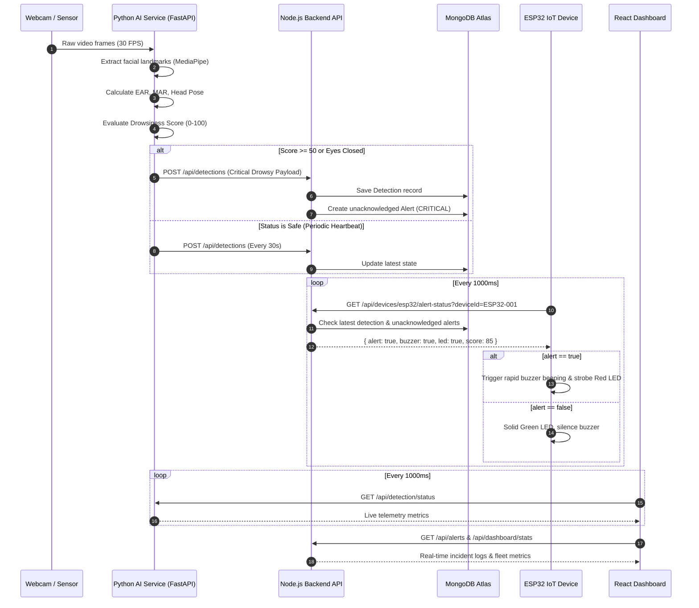

# System Architecture - Driver Drowsiness IoT System

## 1. High-Level Architecture

The Driver Drowsiness IoT System is designed using an event-driven, decoupled microservices pattern comprising four primary layers:
1. **Edge Perception Layer (Python / MediaPipe / OpenCV)**
2. **Control & Persistence Layer (Node.js / Express / MongoDB Atlas)**
3. **Physical Actuation Layer (ESP32 DevKit V1 / Actuators)**
4. **Presentation & Supervisory Layer (React / Vite / Charting)**

```
+-----------------------------------------------------------------------------------+
|                              PRESENTATION LAYER                                   |
|                     React 18 + Vite Web Dashboard (Port 5173)                     |
+--------------------------+-----------------------------------+--------------------+
                           |                                   |
                           | Video Stream & Status             | REST API & JWT Auth
                           v                                   v
+--------------------------+--------+         +----------------+--------------------+
|       PERCEPTION LAYER            |         |          CONTROL LAYER              |
|  Python FastAPI AI Service (8000) |         |     Express REST API (Port 5000)    |
|  • OpenCV DirectShow Frame Capture|         |     • Alert Generator & Deduplicator|
|  • MediaPipe 468-point Face Mesh  |         |     • Fleet & Device Registry       |
|  • EAR / MAR / solvePnP Estimator |         |     • JWT Authentication            |
+--------------------------+--------+         +----------------+--------------------+
                           |                                   |
                           | Asynchronous Alert Event          | MongoDB Driver (Mongoose)
                           | POST /api/detections              v
                           +------------------------->+--------+--------------------+
                                                      |      DATABASE LAYER         |
                                                      |   MongoDB Atlas Cloud DB    |
                                                      |   Collections: Detections,  |
                                                      |   Alerts, Drivers, Devices  |
                                                      +----------------+------------+
                                                                       ^
                                                                       | HTTP Polling (1 Hz)
                                                                       | /api/devices/esp32/
                                                      +----------------+------------+
                                                      |       PHYSICAL LAYER        |
                                                      |      ESP32 IoT Module       |
                                                      | • Piezo Buzzer (GPIO 18)    |
                                                      | • Red Alert LED (GPIO 19)   |
                                                      | • Green Safe LED (GPIO 21)  |
                                                      | • Vibration Motor (GPIO 22) |
                                                      | • Mute Button (GPIO 4)      |
                                                      +-----------------------------+
```

---

## 2. Component Interactions & Sequence Flow

### Drowsiness Detection & Alert Trigger Sequence



---

## 3. Data Flow Specifications

1. **Perception to Control Data Transfer**:
   - Transmitted via HTTP/1.1 JSON payload over local loopback or intranet.
   - Non-blocking background dispatch using Python daemon threads ensures computer vision processing latency remains under 35ms per frame.
   - Debounce mechanism prevents database flood by imposing a 4-second cooldown between duplicate alert dispatches.

2. **Control to IoT Hardware Data Transfer**:
   - Lightweight JSON response format (`< 150 bytes`) allows microcontrollers with constrained memory to parse buffers without fragmentation.
   - In the event of network disruption, the ESP32 automatically attempts reconnect while maintaining local fail-safe state.
